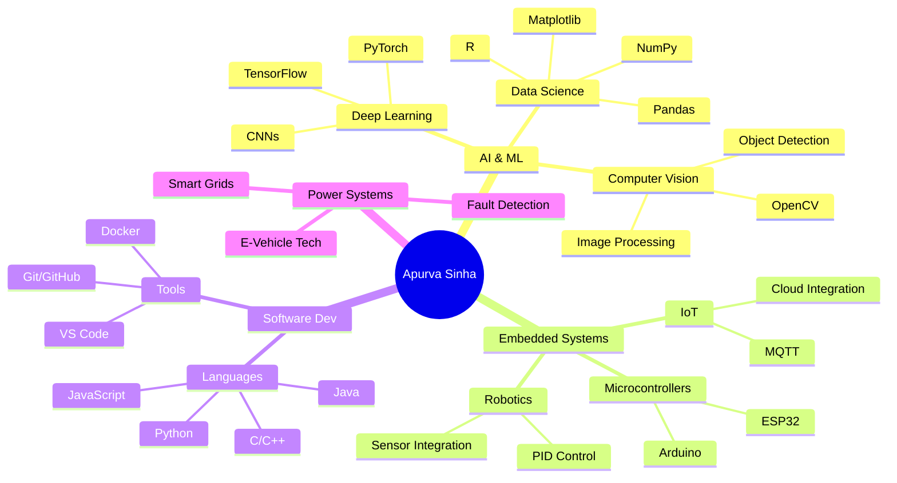

<div align="center">

# ⚡ APURVA SINHA

```ascii
╔═══════════════════════════════════════════════════════════╗
║  Electrical Engineer • AI Architect • Open Source Builder ║
║          Turning Caffeine into Code Since 2024            ║
╚═══════════════════════════════════════════════════════════╝
```

[](https://git.io/typing-svg)

</div>

<br>

### 🎯 Currently Pursuing

🎓 **BTech in Electrical Engineering** (E-Vehicle Technology) @ RGIPT  
🔬 **Building:** AI Models • IoT Systems • Data Analytics Platforms  
🚀 **Exploring:** Computer Vision • Deep Learning • Embedded Systems

---

## 🧬 ABOUT ME

```python
class ApurvaSinha:
    def __init__(self):
        self.username = "apurvafx"
        self.location = "Lucknow, India"
        self.education = "RGIPT | Electrical Engineering"
        self.interests = ["AI/ML", "Computer Vision", "Embedded Systems", "Robotics"]
        self.current_focus = "Building Innovative Projects"
        self.life_philosophy = "Treat bugs as plot twists 🎬"
    
    def daily_routine(self):
        return {
            "morning": "☕ Coffee",
            "day": "💻 Code",
            "evening": "🔬 Experiment",
            "night": "📚 Learn",
            "repeat": True
        }
    
    def skills(self):
        return {
            "languages": ["Python", "C++", "C", "Java", "JavaScript", "MATLAB", "R"],
            "ai_ml": ["TensorFlow", "PyTorch", "OpenCV", "Scikit-learn"],
            "data_science": ["Pandas", "NumPy", "Matplotlib", "Streamlit", "Gradio"],
            "embedded": ["Arduino", "ESP32", "IoT", "MQTT"],
            "tools": ["Git", "VS Code", "PyCharm", "Jupyter", "Docker"]
        }
```

---

## 🛠️ TECH ARSENAL

### Languages & Databases


### AI/ML Frameworks


### Data Visualization & Deployment


### Embedded Systems & IoT


### Development Tools


---

## 🚀 FEATURED PROJECTS

<table>
<tr>
<td width="50%">

### 📊 Aadhaar Enrolment Insights
**1.4B Records | Data Analytics Platform**

Built comprehensive analytics platform analyzing India's Aadhaar enrolment data using **Python**, **Pandas**, and **NumPy**.

🔹 Statistical analysis & visualization  
🔹 Demographic trend analysis  
🔹 Data-driven insights generation

**Tech Stack:** Python • Pandas • NumPy • Matplotlib • Data Analytics

[](https://github.com/apurvafx/Aadhaar-Enrolment-Insights)

</td>
<td width="50%">

### 🧮 Handwritten Math Solver
**OCR + Deep Learning + Symbolic Math**

AI-powered system that recognizes handwritten mathematical expressions and solves them instantly.

🔹 CNN + Transformer models  
🔹 Real-time processing with **Gradio**  
🔹 Google Cloud Vision API integration

**Tech Stack:** TensorFlow • PyTorch • OpenCV • Gradio • SymPy

[](https://github.com/apurvafx/AI-Model-for-Handwritten-Math-Expression-Recognition-and-Solving)

</td>
</tr>

<tr>
<td width="50%">

### 🌙 LunaDepthNet
**Physics-Informed Depth Estimation**

Advanced depth estimation for lunar terrain using **MiDaS** with physics-based photoclinometry constraints for accurate surface reconstruction.

🔹 MiDaS depth estimation model  
🔹 Photoclinometry integration  
🔹 Physics-informed predictions

**Tech Stack:** PyTorch • MiDaS • Computer Vision • Photoclinometry

[](https://github.com/apurvafx/LunaDepthNet-Physics-Informed-Lunar-Depth-Estimation-)

</td>
<td width="50%">

### ⚡ IndFault-GCNN
**Power Grid Fault Detection**

Graph Convolutional Neural Network (GCNN) for intelligent fault detection and classification in low-tension distribution lines.

🔹 GCNN-based fault detection  
🔹 Real-time grid monitoring  
🔹 Electrical fault classification

**Tech Stack:** MATLAB • Graph Neural Networks • GCNN • Deep Learning

[](https://github.com/apurvafx/IndFault-GCNN-LT-Distribution-Line-Fault-Detection)

</td>
</tr>

<tr>
<td width="50%">

### 😎 Face Recognition System
**Real-time Identity Verification**

Deep learning-based facial recognition with high accuracy for security applications.

🔹 Real-time detection & recognition  
🔹 OpenCV + Deep Learning  
🔹 High-accuracy verification

**Tech Stack:** OpenCV • Python • Deep Learning • Computer Vision

[](https://github.com/apurvafx/Face-Recognition)

</td>
<td width="50%">

### ✊ Rock Paper Scissors AI
**Interactive Game with AI Opponent**

Classic game reimagined with AI in a sleek Streamlit interface.

🔹 AI opponent with strategy  
🔹 Interactive UI/UX  
🔹 Real-time gameplay

**Tech Stack:** Streamlit • Python • Game AI

[](https://github.com/apurvafx/Rock-Paper-Scissors)

</td>
</tr>

</table>

---

<div align="center">

## 🏆 ACHIEVEMENTS & MILESTONES

```
┌─────────────────────────────────────────────────────────────┐
│                     HALL OF ACHIEVEMENTS                     │
├─────────────────────────────────────────────────────────────┤
│                                                              │
│  🥈  2nd Runner-Up | IEEE KodeKurrent Hackathon 2025        │
│      → 24-hour coding marathon, 30+ competing teams         │
│      → Built AI-powered solution from scratch               │
│                                                              │
│  📜  MATLAB Certified | MathWorks                            │
│      → 100% completion on June 28, 2025                     │
│                                                              │
│  🎓  Academic Excellence                                     │
│      → Class X: 96.0% (ICSE)                                │
│      → Class XII: 92.25% (ISC)                              │
│                                                              │
│  💻  Active Developer & Builder                              │
│      → 7+ projects across AI/ML and Embedded Systems        │
│      → Continuous learning and innovation                   │
│                                                              │
└─────────────────────────────────────────────────────────────┘
```

</div>

---

<div align="center">

## 📊 GITHUB ANALYTICS


### 🏅 GitHub Trophies


</div>

---

<div align="center">

## 🌟 CONTRIBUTION STATS


</div>

---

## 🎨 SKILLS BREAKDOWN



---

<div align="center">

## 📈 CODING ACTIVITY


</div>

---

## 🎯 CURRENT FOCUS

```diff
+ 🔥 Building Production-Ready AI Applications
+ 🧠 Mastering Deep Learning Architectures  
+ 🤖 Exploring Computer Vision & Neural Networks
+ ⚡ Developing Edge AI & Embedded ML Systems
+ 📊 Working on Large-Scale Data Analytics
+ 🚀 Creating Innovative Tech Solutions
```

---

## 💡 PHILOSOPHY & APPROACH

> ### *"Code is poetry written in logic"*

```javascript
while (alive) {
    eat();
    code();
    sleep();
    repeat();
}

// Life motto: Turn bugs into features 🐛 → ✨
```

**My Approach to Problem Solving:**

```
1. ☕ Get Coffee
2. 🤔 Understand the Problem
3. 💭 Think of Solutions
4. 💻 Code Like Crazy
5. 🐛 Debug (a lot)
6. 🎉 Celebrate
7. 📚 Document Everything
8. 🔁 Repeat
```

---

## 🌐 CONNECT WITH ME

[](https://www.linkedin.com/in/apurva-sinha-/)
[](https://github.com/apurvafx)
[](mailto:apurvasinha306@gmail.com)
[](tel:+919580672297)

### 📬 Let's Collaborate!

```
📧 Email: apurvasinha306@gmail.com
📱 Phone: +91-9580672297
💼 LinkedIn: linkedin.com/in/apurva-sinha-
🐙 GitHub: github.com/apurvafx
```

**Open to:**
- 🤝 Open Source Collaborations
- 💼 Internship Opportunities  
- 🔬 Research Projects
- 🎓 Mentorship & Knowledge Sharing
- 💡 Innovative Project Ideas

---

<div align="center">

## 🎨 FUN ZONE

### 🎲 Random Dev Quote


### 😂 Dev Joke of the Day


</div>

---

## 🌟 FUN FACTS ABOUT ME

```
🌙  Night owl - Best code happens after midnight
☕  Coffee enthusiast - Debugging fuel since day one  
🎮  Gaming break = Algorithm inspiration
📚  Reading ML papers like novels
🏃  Marathon runner (both literally and figuratively)
🎨  UI/UX appreciation - Beauty in code matters
🧩  Puzzle solver - Rubik's cube in under 2 minutes
🎬  Movie buff - Especially sci-fi and tech thrillers
```

---

### 💭 Developer Wisdom

```
"First, solve the problem. Then, write the code."
— John Johnson

"Any fool can write code that a computer can understand.
Good programmers write code that humans can understand."
— Martin Fowler

"The best error message is the one that never shows up."
— Thomas Fuchs
```

<div align="center">

---

**💡 Remember:** *Every expert was once a beginner. Keep coding, keep learning!*

```
╔═══════════════════════════════════════════════════════════╗
║  "The only way to do great work is to love what you do"  ║
║                     — Steve Jobs                          ║
╚═══════════════════════════════════════════════════════════╝
```

**⚡ Let's build something amazing together! ⚡**

</div>
